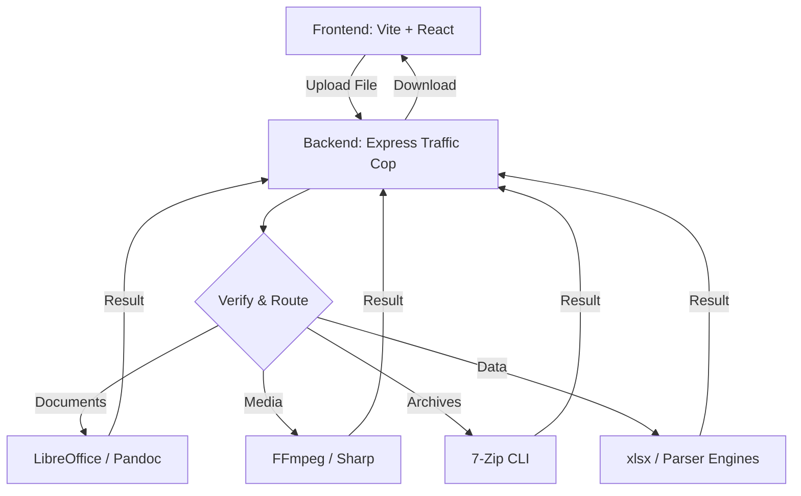

# ByteMorph — Modular Industrial File Converter

**ByteMorph** is an ultra-fast, local-first, and modular full-stack application designed for high-performance file conversions. By leveraging native system binaries rather than cloud-based APIs, ByteMorph provides lightning-fast processing while ensuring 100% data privacy.

---

## Why ByteMorph?

- **Zero Cloud**: Your files never leave your machine.
- **Traffic Cop Architecture**: A modular routing system that delegates tasks to specialized high-performance engines.
- **Industrial Strength**: Handles exotic formats like EPUB, MOBI, PSD, and SVG alongside standard DOCX, PDF, and AVIF.
- **Diagnostic Dashboard**: On startup, the server automatically probes your system to verify available processing engines.

---

## Architecture: The "Traffic Cop" Pattern

ByteMorph follows a clean, decoupled architecture:

1. **Express Router (Traffic Cop)**: Receives the upload and determines the conversion type.
2. **Specialized Engines**: Isolated logic for each category (Documents, Video, Audio, Data, etc.).
3. **Native Decoders**: Delegates heavy lifting to system binaries like LibreOffice, Pandoc, and FFmpeg for maximum throughput.



---

## Tech Stack & Dependencies

### Frontend (Vite + React 19)

- **Engine**: React 19 + Vite for sub-second hot reloads.
- **Visuals**: `three.js` for dynamic 3D backgrounds and `react-typed` for interactive UI elements.

### Backend (Node.js + Express)

- **Core**: `multer` for stream tracking, `bcryptjs` for security, and `jsonwebtoken`.
- **Media**: `sharp` (Images), `fluent-ffmpeg` (A/V).
- **Data**: `xlsx`, `csv-parse`, `fast-xml-parser`, `js-yaml`.
- **Archives**: `archiver` & `7-zip` integration.

---

## System Prerequisites

ByteMorph uses direct system execution for its core engines. For full functionality, ensure the following are installed and added to your system `PATH`:

| Engine | Purpose |
|---|---|
| **LibreOffice** | DOCX, PPTX, and PDF document processing. |
| **FFmpeg** | High-performance Audio/Video transcoding (Auto-bundled). |
| **Pandoc** | Markdown, EPUB, and LaTeX conversions. |
| **ImageMagick** | Exotic image handling (PSD, SVG, WebP). |
| **7-Zip (7z)** | Extreme archive compression and repackaging. |
| **Ghostscript** | Advanced PDF compression algorithms. |

---

## How to Start Locally

### 1. Install Dependencies

Open two terminals in the project root:

**Terminal 1 (Frontend):**

```bash
npm install
```

**Terminal 2 (Backend):**

```bash
cd Server
npm install
```

### 2. Launch the Application

**Start Backend:**

```bash
cd Server
node server.js
```

*Look for the **Diagnostic Dashboard** in the console to verify your system engines.*

**Start Frontend:**

```bash
npm run dev
```

Navigate to `http://localhost:5173`.

---

## Authentication

ByteMorph includes a lightweight local session system (`users.json`) with JWT-signed tokens, allowing for secure multi-user environments on a single local node.

---
Built with Love for High-Performance Workflows
